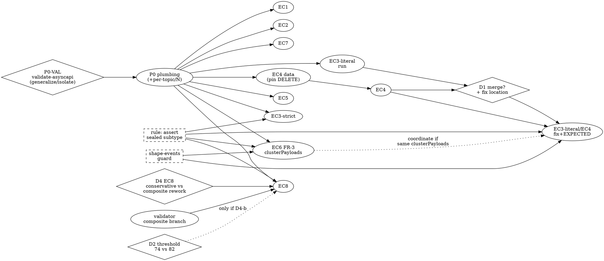

# Client Feedback — Implementation Plan (Revised, consolidated)

> **Revision note.** This is a single coherent rewrite that supersedes the first draft and folds in
> five rounds of review. Do not read it as a base + addenda — every decision is integrated in place.
> §8 (Dependency Graph) is the sequencing contract; read it before starting any work. Appendix A maps
> the 19 accumulated change items to where they now live, so nothing is lost.

- **Date:** 2026-06-29
- **Inputs:** [`client_feedback.md`](./client_feedback.md) (verdicts), [`discriminator-edge-cases.md`](./discriminator-edge-cases.md) (client payloads + expected AsyncAPI), `specmatic/kafka-spy-docs/discriminator-inference-spec.md` (FR clauses), and the specmatic engine source (traced, not assumed).
- **Scope (agreed):** *Tests + fixes.* Build data/tests, run them, compare observed output to the client's expected snippet; where they diverge, fix the specmatic source — **unless** the divergence is a defensible engine answer the client's prose allows, in which case it becomes a negotiation (EC3-literal, EC4).
- **EC6 (agreed):** test the **≥70%** optional-field case now; the **<70%** threshold negotiation is a follow-up (§9, D3).

---

## 0. Headline classification (code-grounded, post-review)

This **revises both** `client_feedback.md`'s optimistic "7 of 8 are our miss, just confirm" **and**
the first draft of this plan. Predictions below were traced through `DiscriminatorInferrer.kt`,
`MessageGrouper.kt`, `KafkaSpy.kt`, and `JsonSchemaInferrer.kt` against the client's *exact* payloads.

| EC | Class | Current behavior (traced) | Client wants | Action |
|----|-------|---------------------------|--------------|--------|
| 1 Competing `eventType`/`source` | **Confirm** | `EXPLICIT_SINGLE eventType` (+10 vs 0 semantic; deterministic sort) | same | confirmation test |
| 2 False-positive `status` | **Confirm** | `EXPLICIT_SINGLE eventType` (+10 vs −10) | same | confirmation test |
| 3-strict (only `eventType` varies) | **Confirm** | `None` → `SINGLE_TYPE`, merged schema, `eventType` optional | same | confirmation test; unit asserts `None` |
| 3-literal (`eventType` **and** `name` vary) | **Negotiate** | `IMPLICIT_SHAPE` (`eventType.json`, `name.json`) | single merged schema | gated by **D1** |
| 4 Overlapping value `UPDATE` | **Negotiate** | `IMPLICIT_SHAPE` (`name.json`, `amount.json`) | single merged schema | gated by **D1** (isomorphic to 3-literal) |
| 5 Small-sample bias | **Confirm** (now also the **D4-a regression guard** — see §0a/**B2**) | `EXPLICIT_SINGLE eventType` (total ≥3); `SINGLE_TYPE` at total=2; never `country` | same | multi-N confirm; needs per-topic publish (P0) |
| 6 Optional field (≥70%) | **Fix** | A: likely `SINGLE_TYPE` merged; B: `eventType` rejected, purity ≈ coupon rate (0.70 floor / 0.75 example) | one schema, `coupon` optional / `EXPLICIT_SINGLE` (B) | FR-3 tolerance in `clusterPayloads()` |
| 7 Same shape, no discriminator | **Covered** | `NoVariants` → `SINGLE_TYPE` (≈ Scenario 3) | same | optional confirmation topic |
| 8 Composite `channel`+`phase` | **Fix (needs design; D4-a bypassed as specified — see §0a/B1)** | `EXPLICIT_SINGLE channel` (single qualifies in Step 6 → composite never runs; even forced, composite scores ≈63 < both gates) | no misleading single-field split — `EXPLICIT_COMPOSITE [channel,phase]` *or* conservative `SINGLE_TYPE` | **D4** design (scan all pairs; pin `paymentId` high-card) + **D2** + validator branch |

**Why the divergences exist (root causes):**
- **EC3-literal and EC4 are structurally isomorphic** — two clusters sharing a core, each with one
  unique field → `deriveImplicitShape()` finds a signature per cluster → split. The *reason* the
  candidate was rejected differs (EC3: `eventType` fails the 0.8 presence gate; EC4: `type` fails
  cardinality/purity) but those rejections are **correct**; the bug is the identical downstream
  `IMPLICIT_SHAPE`. They share one fix surface — and it is **not** EC6's (their differing fields are
  <70%, so the FR-3 ≥70% tolerance does not merge them).
- **EC6** — `clusterPayloads()` clusters by exact field-set with no optional-field tolerance, so an
  optional field fragments clusters; with multiple event types this drags the `eventType` value's
  purity to ≈ the coupon presence rate (0.70 at the 70% floor, 0.75 at the example rate) <
  `minimumPurity` 0.85 → `eventType` rejected. The FR-3 merge restores purity to 1.0.
- **EC8** — all four combos share one structural shape → one cluster → `channel` alone clears the
  Step-6 single-path gate (purity 1.0 against the lone cluster) and returns `EXPLICIT_SINGLE channel`
  at `infer():153` (the `NoVariants` fallback at `:201` is *after* Steps 6–7, so it is never reached).
  *And it can't be rescued by gate/margin tweaks:* even forced into Step-7, the `channel`+`phase`
  composite scores **≈63** (`25 + categoricalBase 8 + purity 35 − 5`; the `|4 combos − 1 cluster|`
  distance costs 12), failing both the `74` threshold and `composite.score > bestSingleScore(81) + 8`.
  The cluster-based scoring structurally favors the single for same-shape data — so EC8 needs a design
  decision (**D4**), not a one-line gate change.
- **`SINGLE_TYPE` has two sources — don't conflate.** EC3/EC6/EC7 topics run **without**
  `--discriminator`, so the engine's `None`/`NoVariants` falls into `SpyMetadataWriter`'s `else` branch
  → `SINGLE_TYPE`. order/payment/user-events run **with** `--discriminator` and get `EXPLICIT_SINGLE`
  via the separate `explicitDiscriminatorField` branch. Same metadata family, different code path.

> These remain **predictions** until run (§3 loop). EC3-strict, EC3-literal, EC4, EC6, EC8 outcomes are
> *traced* through code and are higher-confidence than score-based estimates.

---

## 0a. Confirmed blockers & regressions (measured against the engine, 2026-06-29)

Two review predictions were **run through `DiscriminatorInferrer.infer()` plus the internal scoring
pipeline** on the client's *literal* payloads (not the plan's tuned generators). Both reproduce a problem
that changes what "correct" means **before any test is written**. They gate **D4** and the EC5 regression
guard — resolve before Phase 3.

### Blocker B1 — EC8 D4-a suppression is bypassed by a correlated `paymentId` (the client's own data)

The client's EC8 payload carries `paymentId` correlated 1:1 with `channel` (`p-1↔CARD`, `p-2↔BANK`); a
faithful generator reproduces it. Measured at N=400 (one structural cluster):

```
path=channel    score=81 purity=1.000  [pres=25 cat=16 clpur=35 sem=0 depth=5 pen=0]
path=paymentId  score=81 purity=1.000  [pres=25 cat=16 clpur=35 sem=0 depth=5 pen=0]
path=phase      score=81 purity=1.000  [pres=25 cat=16 clpur=35 sem=0 depth=5 pen=0]
GAP rank1-rank2 = 0   (winner=channel, 2nd=paymentId)
RESULT = ExplicitSingle(path=channel, score=81, clusterCount=1)
```

All three fields tie at 81; the alphabetical tie-break (`infer():122`) makes **`paymentId` the 2nd-ranked
candidate, not `phase`**. The §4 D4-a suppression is specified against "the **2nd-ranked** candidate" — but
`channel`+`paymentId` yields **no extra value-combinations** (paymentId is redundant with channel), so the
cross-cut condition **does not fire** and the bad `EXPLICIT_SINGLE channel` survives the fix.

**Required design changes (before Phase 3):**
1. The suppression must scan **all pairs** in `topCandidatesForComposite` (as Step-7 already does), not
   only rank-1 vs rank-2 — the cross-cutting partner (`phase`) is rank-3 here.
2. The `composite-discriminator-events` generator must make `paymentId` **high-cardinality** (unique per
   record → all-unique −30 penalty → score ≈35, out of contention) so it cannot tie the real candidates.
   Add a generator self-check asserting filler-id fields are unique. The same filler-cardinality discipline
   applies to EC2's `paymentId` and EC1's `orderId` — both must be unique-per-record or they re-enter
   candidate competition and can invalidate those cases' traced outcomes.

### Blocker B2 — EC5's D4-a safety margin is 2 points, not 18, under the client's literal data

§4 EC8-guard / §9 Q8 calibrate the window as `0 ≤ X < 26` with `X ≈ 8`. That `26` is an artifact of the
plan's **10-value** `country` generator. The client's literal EC5 payload uses **`country ∈ {US, IN}` —
2 values**. Measured at N=400 (single shape → one cluster):

```
path=eventType  score=91 purity=1.000  [pres=25 cat=16 clpur=35 sem=10 depth=5 pen=0]
path=country    score=81 purity=1.000  [pres=25 cat=16 clpur=35 sem=0  depth=5 pen=0]
path=userId     score=35 purity=1.000  [pres=25 cat=0  clpur=35 sem=0  depth=5 pen=-30]
GAP rank1-rank2 = 10  (winner=eventType, 2nd=country)
RESULT = ExplicitSingle(path=eventType, score=91)
```

With 2-value `country` the gap is exactly **10**, and every sub-score is identical to `eventType`
**except** the `+10` positive-name bias (`sem`). So under faithful data the safe window is `0 ≤ X < 10`
and the proposed `X ≈ 8` has only a **2-point** margin. Corollary: had the client's competitor field
carried a positive-bias name (`type`/`kind`/`action`), the gap would be **0** and EC5 would be
numerically indistinguishable from EC8 — D4-a would be **impossible**, not merely tight.

**Required design changes (before Phase 3):**
1. Either **pin EC5's `country` to ≥3 distinct values and document that D4-a's margin depends on it**, or
   re-calibrate `X` against the faithful 2-value case (window `0 ≤ X < 10`; a smaller `X ≈ 4` restores a
   comfortable margin) — and verify it still fires for EC8 (gap 0).
2. Treat B2 as a **co-blocker with B1**: together they suggest a pure score-gap trigger is too brittle, and
   D4-a should key on the *structural* cross-cut (a bounded categorical partitioning the winner's values
   within one cluster) rather than a tuned point gap.

### B3 — EC6's FR-3 merge lowers the discriminator-reliability bar to 85% presence (regresses EC3)

The EC6 fix merges clusters that differ only by a field present in ≥70% of the merged group. That same merge
collapses an EC3-style **partial discriminator** into one cluster, where it can then be promoted to
`EXPLICIT_SINGLE`. **The review first predicted the danger band as `[70%, 80%)`; the engine corrected both
the band and the mechanism.** Measured by scoring through the post-merge single-cluster topology (= what the
fix produces) across presence rates:

```
present=70%  eventType score=81 purity=0.700  -> rejected on purity (safe)
present=84%  eventType score=85 purity=0.840  -> rejected on purity (safe)
present=85%  eventType score=86 purity=0.850  -> EXPLICIT_SINGLE (REGRESSION)
present=90%  eventType score=88 purity=0.900  -> EXPLICIT_SINGLE (REGRESSION)
present=95%  eventType score=89 purity=0.950  -> EXPLICIT_SINGLE (REGRESSION)
```

**Mechanism (corrected):** in the merged single cluster `purity = presence_rate` — the purity denominator is
*total* payloads, and the absent-field payloads contribute 0 (confirmed `nullCount=0` at 25% absence:
`classifyObservedValues` counts only explicit JSON `null`, never an absent key). So the binding gate is
**`minimumPurity = 0.85`**, *not* the null penalty the review originally cited. The regression band is
therefore **`[85%, 100%)`**:
- `[70%, 85%)` — FR-3 merges, but purity < 0.85 → still rejected → `SINGLE_TYPE` (safe).
- `[85%, 100%)` — FR-3 merges, purity ≥ 0.85 → promoted to `EXPLICIT_SINGLE` on a field absent from up to
  15% of messages — exactly what EC3 says must not become a clean single-field discriminator.

Without the fix, any partial field is rejected at the 2-cluster stage (FR-4 presence gate, 0.5 < 0.8) →
`SINGLE_TYPE`. So the FR-3 fix **lowers the effective "reliably present" bar from a de-facto 100% to 85%.**

**Severity: medium / decision-class (not a hard bug).** ≥85% presence is a defensible discriminator to some
readers, but it contradicts EC3's literal "discriminator field must be reliably present." **Required before
the EC6 fix ships:**
1. **Decide the reliability floor with the client** (fold into **D3**). If EC3 requires stricter than 85%,
   the FR-3 fix must **exclude the merge-justifying still-partial field from discriminator candidacy after
   the merge** (it is "optional" by construction) — not merely mark it optional in the schema.
2. EC3-strict at 60% presence is doubly safe (below both 70% and 85%) and **cannot detect this regression.**
   Add a guard unit case / topic at **~90% presence** asserting the client-decided outcome.
3. Coordinate with **§5 "Interaction to watch"** — EC6 and EC3 both hinge on `clusterPayloads()`.

**`shape-events` guard — measured safe (with a caveat).** Ran CARD_PAYMENT vs BANK_TRANSFER (sharing only
`amount`) through the engine: current `clusters=2 → IMPLICIT_SHAPE, signatures=2` (baseline holds). Per-field
presence in the merged group: every cluster-unique field sits at **50%**, only the shared `amount` is ≥70%
(100%). Because the two clusters' unique fields are **mutually exclusive** (CARD-unique ≤ cardFrac,
BANK-unique ≤ bankFrac, summing to 100%), they can **never both reach 70%** — so an FR-3 rule phrased as
*"merge only when **all** differing fields are ≥70%"* **structurally cannot fire** on `shape-events`,
independent of any Jaccard threshold. **This guarantee depends on that phrasing:** a rule keyed on the
*shared* field, or on "*any* differing field ≥70%", is not protected by this argument. Encode the
"all differing fields" form and keep the assertion.

**Bonus fragility found while probing:** with a *constant / low-cardinality* `amount`, the engine flips
`shape-events` to `EXPLICIT_SINGLE amount` (amount becomes a 2-value, purity-1.0, score-70 discriminator).
The real generator avoids this only because `amount` is `random.uniform(...)`. Same filler-cardinality
discipline as B1/#6 — `shape-events`' `IMPLICIT_SHAPE` result silently depends on `amount` staying
high-cardinality; pin and assert it in the generator self-check.

> **Method:** built the literal payloads in-code, dumped per-candidate sub-scores and the final `infer()`
> result via the `internal` scoring functions (B1/B2) and a presence-rate sweep through a hand-merged
> single cluster (B3), and a `shape-events` baseline + per-field-presence probe, then removed the throwaway
> tests. The numbers above are engine output, not estimates. B1's `EXPLICIT_SINGLE channel`, B2's gap=10,
> B3's 85% purity cliff, and `shape-events` `IMPLICIT_SHAPE`/50%-presence are all reproduced.

---

## 1. Harness pipeline & extension points

```
generate_events.py → events-cache/<TYPE>.json
   → publish_events.py (POST /api/events/raw?topic=<t>, no producer rebuild)
   → config/<topic>.yaml (kafka-spy probe + sample)
   → kafka-spy JAR → inferred-schemas/<topic>/{*.json, metadata.json}
   → kafka-asyncapi-merged → asyncapi-specs/all-kafka-events.yaml
   → validate-metadata.py / validate-asyncapi.py vs EXPECTED
```

Every new edge case touches up to **six** points:

| # | File | Change |
|---|------|--------|
| 1 | `scripts/generate_events.py` | one **cycling** generator per topic emitting the full variant mix (§2) |
| 2 | `scripts/publish_events.py` | add topic to `TOPIC_GROUPS` **and** `RAW_TOPICS`; (EC5) per-topic/per-N filter |
| 3 | `config/<topic>.yaml` | kafka-spy config, **no `discriminator:`** so inference runs |
| 4 | `scripts/validate-metadata.py` / `validate-asyncapi.py` | `EXPECTED` entry **(omit for negotiate-class — §2)**; **new `EXPLICIT_COMPOSITE` value branch (sorted)** |
| 5 | `.claude/commands/run-kafka-spy-test.md` | kafka-spy run line (output root `inferred-schemas/`) |
| 6 | `claude_evidence_based_testing.md` | one evidence scenario per case (observed vs expected) |

---

## 2. Cross-cutting conventions (apply to every case)

- **Raw publish, no producer rebuild.** All new topics use `POST /api/events/raw?topic=<t>`; add each to `RAW_TOPICS`. This also handles "same `eventType`, different shape" (EC4/EC6) since it posts raw bodies.
- **One cycling generator per topic.** Emit variants by index so the cache file is **pre-interleaved** (`gen(0)=A, gen(1)=B, gen(2)=C, gen(3)=A,…`). The probe reads the first `probeCount` records, so all variants must appear early — block-generation ("all A then all B") breaks inference. For independent fields (EC1 `source`), **offset the cycles** so they don't accidentally correlate, e.g. `eventType = variants[i % k]`, `source = sources[(i / k) % m]`. (Correlation wouldn't change EC1's result — `eventType` wins on semantic score regardless — but offsetting keeps the test's intent honest.)
- **Test → fix loop.** Run → compare observed `metadata.json` + merged AsyncAPI to the client snippet → if it diverges, add a failing `DiscriminatorInferrerTest` case → fix source → **rebuild the JAR** (`cd ../specmatic && ./gradlew :specmatic-executable:unobfuscatedShadowJar`) → re-run the case **and** the regression set → record evidence. A stale JAR silently runs old logic (this bit the last run).
- **RULE — assert the sealed subtype in unit tests, not the metadata JSON.** `None` and `NoVariants` both serialize to `SINGLE_TYPE` (`SpyMetadataWriter` else-branch), so the harness validator cannot tell a correct path from a wrong one. Every engine unit test asserts e.g. `result is DiscriminatorInferenceResult.None`.
- **RULE — `shape-events` is the regression guard.** Any change to `clusterPayloads()` or `deriveImplicitShape()` must keep `shape-events` (CARD vs BANK) at `IMPLICIT_SHAPE` with ≥2 signatures. Field-set similarity makes this delicate: EC3/EC4 sit at Jaccard ≈0.5 (shared 2 / union 4), `shape-events` at ≈0.14 (shared 1 / union 7) — a merge heuristic must fall in that gap. **Measured (§0a/B3):** for the *FR-3 ≥70% presence* rule specifically, the Jaccard gap is moot — `shape-events`' differing fields are all at 50% (mutually exclusive across the two clusters), so the merge cannot fire as long as the rule is phrased "**all** differing fields ≥70%". What it *does* depend on is `amount` staying high-cardinality (a constant `amount` flips `shape-events` to `EXPLICIT_SINGLE amount`).
- **Staging negotiate-class cases (infra without `EXPECTED`).** For EC3-literal and EC4, add the generator, config, and run line, but **leave the topic out of `EXPECTED`**. The validator WARN-skips unknown topics (`validate-metadata.py:91-92, 131-133`) and only fails on *missing expected* topics (`:145-148`), so the regression stays green while the observed `IMPLICIT_SHAPE` is captured as negotiation evidence. Add the `EXPECTED` entry only after the client answers D1. Never pre-set it to `IMPLICIT_SHAPE` (tautology) or `SINGLE_TYPE` (premature hard-fail).

---

## 3. Decision gates (resolve before dependent code)

| ID | Decision | Gates | Notes |
|----|----------|-------|-------|
| **D1** | EC3-literal/EC4: accept `IMPLICIT_SHAPE` as the client's allowed "ambiguous result", or force a single merge? If merge: fix in `clusterPayloads()` (merge near-identical shapes) **or** `deriveImplicitShape()` (suppress weak single-field signatures), and pick the similarity threshold with margin to `shape-events`. | EC3-literal, EC4 (build + `EXPECTED`) | The client's *prose* permits "schema(s)" / "ambiguous result"; only the *snippets* show one merge. Lean **negotiate** given the `shape-events` blast radius. Needs EC4/EC3-literal **evidence** first. **Potential blocker:** if D1 → *merge*, the `clusterPayloads()` change is high-blast-radius with **no designed similarity threshold yet** (only the Jaccard seed in §2) — scope it as a project, not a quick fix. |
| **D2** | EC8 composite threshold: keep code's `74` (`DiscriminatorInferrer.kt:68`) or raise to spec's `82` (`discriminator-inference-spec.md:67`)? | EC8 fix (only under **D4-b**) | Raising to 82 may break the existing C-9 unit test; keeping 74 leaves spec/code drift. Document the drift either way. **Verified (finding #4):** any change to the threshold *or* the `+8` margin also risks **C-10** (`composite-margin-insufficient`) and **FR-7** (`composite requires +8-point margin`) — both assert `EXPLICIT_SINGLE` and depend on the margin invariant; the plan previously named only C-9. **Note:** the threshold is *not* the main EC8 blocker — even at 74 the composite scores ≈63 and the single wins Step 6 first; see **D4**. |
| **D3** | EC6 sub-70% optional fields (the original negotiation) — lower/parameterize FR-3's 70%, merge-by-value regardless, or accept the split? **Plus (finding #3 / §0a B3): the discriminator-reliability floor** — the FR-3 merge promotes a partial discriminator at ≥85% presence, lowering the bar from de-facto 100% to 85%. What presence floor must a field clear to be a `const` discriminator? | EC6 fix ship-readiness (B3 sub-part) | sub-70% part does **not** block the ≥70% work; **the B3 reliability-floor part does block the EC6 fix.** Ask the client the expected presence rate *and* the reliability floor. |
| **D4** | EC8 same-shape composite: **(a)** detect the *insufficient single* (a bounded field cross-cuts the chosen discriminator's values within one cluster) → emit conservative `SINGLE_TYPE`; or **(b)** rework composite scoring so it can win for single-cluster data. | EC8 fix + its `EXPECTED` | **(a)** is tractable and matches the client's "fall back to conservative" allowance → `EXPECTED = SINGLE_TYPE` (recommended). **(b)** is a scoring-model change with broad blast radius and reopens **D2** → `EXPECTED = EXPLICIT_COMPOSITE`. Neither the Step-6 gate nor the `+8` margin alone suffices. |
| **P0-VAL** | `validate-asyncapi.py` hardcodes `EXPECTED_TOPICS = 6` (`:15`) and fails if the merged spec's channel/operation count ≠ 6 (`:58-65`) — so **any** new topic breaks it. Choose: **(a)** generalize the validator to a dynamic/known topic set, or **(b)** run edge cases in an **isolated** output root (`inferred-schemas-edge/`) + separate merged spec + separate validation. | **all** new-topic work | Lean **(b)** — keeps the pristine 6-topic regression untouched and sidesteps the hardcoding. Resolve first (Phase 0). |

---

## 4. Per-edge-case work items

Topic names are kebab-case `*-events`. `EXPECTED` = client-desired outcome (test stays red until the
engine is correct) **except** negotiate-class (omit per §2).

### EC1 — `competing-candidates-events` · Confirm
- **Data:** cycle `eventType ∈ {ORDER_CREATED, ORDER_CANCELLED, ORDER_REFUNDED}`, distinct shape each; cross-cutting `source ∈ {web, mobile, api}` via an **offset** modulus (§2).
- **EXPECTED:** `EXPLICIT_SINGLE`, `eventType`. **AsyncAPI:** `eventType` `const` per message, `source` plain `enum`.
- **Fix:** none expected — deterministic semantic-gap win.
- **⚠ Client-snippet divergence (finding #6):** the client's EC1 snippet shows exactly **2** messages (`ORDER_CREATED`, `ORDER_CANCELLED`); this plan generates **3** variants (adds `ORDER_REFUNDED`). The third variant isn't needed for the semantic-gap win (a 2/2 cluster split already scores perfectly), and it makes the observed AsyncAPI a 3-message spec that won't compare 1:1 with the client's 2-message snippet. **Either match the client's 2 variants, or annotate the divergence explicitly in the evidence row.** Same discipline as B1: keep `orderId` unique-per-record so it doesn't re-enter candidacy.

### EC2 — `false-positive-events` · Confirm
- **Data:** `eventType ∈ {PAYMENT_INITIATED, PAYMENT_COMPLETED}`, distinct shapes; `status ∈ {NEW, DONE}` perfectly correlated (the hard case). Runs at normal sample size (no all-unique penalty applies at N≫2).
- **EXPECTED:** `EXPLICIT_SINGLE`, `eventType`. **AsyncAPI:** `eventType` `const`; `status` plain `enum`.
- **Fix:** none expected (`eventType` ≈95 vs `status` ≈75; scores approximate, conclusion robust).

### EC3 — `partial-field-events` · split into two variants
Two generators / two topics, because they exercise different paths:
- **EC3-strict `partial-field-events` · Confirm.** Only `eventType` presence varies (~60% have `{eventType,userId,email}`, ~40% `{userId,email}`). Traced: `eventType` fails the 0.8 cluster-presence gate; `deriveImplicitShape()` returns null because cluster-2's fields `{userId,email}` also appear in cluster-1 → they fail the `outPresence ≤ 0.2` gate → cluster-2 has zero signature paths → `any{ isEmpty }` short-circuits → **`None`** → `SINGLE_TYPE`. `JsonSchemaInferrer` unions keys (`:35`) and marks `required` only when non-null in every sample (`:51`), so the merged schema has `eventType` **optional**, `required:[email,userId]`. **EXPECTED:** `SINGLE_TYPE`. **Unit test asserts `result is None`** with the out-presence-gate reason in the comment.
- **EC3-literal `partial-field-literal-events` · Negotiate (D1).** `eventType` **and** `name` both vary (the client's literal payloads) → cluster-1 sig `[eventType]`, cluster-2 sig `[name]` → **`IMPLICIT_SHAPE`**, contradicting the client's single-merge snippet. Isomorphic to EC4. **Stage without `EXPECTED`** (§2); record `IMPLICIT_SHAPE` as D1 evidence.

### EC4 — `overlapping-values-events` · Negotiate (D1)
- **Data:** one generator, `type="UPDATE"` across two **pinned** shapes — `{type,name,updatedAt}` and `{type,amount,updatedAt}` — plus a small share of **`type="DELETE"` with a pinned distinct shape** `{type,reason,updatedAt}` so `type` has cardinality ≥2 and the **purity** path (not just the cardinality gate) is exercised. With DELETE distinct, expect **3** clusters → `IMPLICIT_SHAPE` with **3** signatures (`name.json`, `amount.json`, `reason.json`). *(If DELETE instead reused an UPDATE field-set, you'd get 2 clusters — hence the shape is pinned.)*
- **Traced current:** `type` correctly **not** chosen as discriminator (good); shapes differ → `IMPLICIT_SHAPE` (the split the client doesn't want).
- **Generator discipline:** the three shapes must have **disjoint** unique fields (`name` / `amount` / `reason`). A leak (e.g. `name` into the DELETE shape) collapses cluster-A's signature → the result falls through to `None` instead of `IMPLICIT_SHAPE`, silently changing what the test exercises. Add a generator self-check asserting the per-shape field sets are disjoint.
- **Stage without `EXPECTED`** (§2). The merge-vs-`IMPLICIT_SHAPE` call and fix location are **D1**, shared with EC3-literal; guard `shape-events`.

### EC5 — `small-sample-events` · Confirm (needs P0)
- **Data:** `eventType ∈ {USER_REGISTERED, USER_DELETED}`, same shape, cross-cutting `country`.
- **Multi-N:** the all-unique penalty (−30) fires for a field while every payload has a distinct value. `country` (cycles 10 values) is penalized while total payloads ≤ 10; `eventType` (2 values) is all-unique only at **total = 2** (1 per type). So at **total 2** *both* are penalized and score < 70 → no single qualifies → `SINGLE_TYPE`; from **total ≥ 3** `eventType` clears 70 and wins on its +10 semantic floor while `country` stays penalized/low-categorical. Verify **total = 2, 3, 4, and large N**.
- **Prerequisite:** per-topic / per-N publishing (P0) — running the whole suite at N=2 would wreck `inferred-events` enum completeness and other quality scenarios; **do not** use a whole-suite-low-N fallback.
- **EXPECTED:** `EXPLICIT_SINGLE eventType` from **total ≥ 3**; at the faithful 1-per-type sample (**total = 2**) `eventType` is itself all-unique (score ≈50 < 70) → `SINGLE_TYPE`/`NoVariants` — which still satisfies the client's real concern (**never `country`**). The probe runs at total=2 (the per-topic `probePayloads.size < 2 → NoVariants` guard in `KafkaSpyConsumer` needs ≥2, met here). **Fix:** none expected — the small-N `SINGLE_TYPE` is correct behavior, not a bug.

### EC6 — `optional-field-events` (+ `optional-field-multitype-events`) · Fix (FR-3)
- **Data A (client literal):** single `eventType=ORDER_CREATED`, `coupon` present in **≥70%** (e.g. `i % 4 != 0`).
- **Data B (the hard case):** `eventType ∈ {ORDER_CREATED, ORDER_UPDATED}`, each with `coupon` at ≥70%. Traced: clusters fragment by `coupon` presence; the per-value purity **equals the coupon presence rate `p`** (dominant cluster share) — **0.70** at the 70% floor, **0.75** at the example rate — both < 0.85 → `eventType` rejected. The fix's safety margin is `0.85 − p`, so the 0.70 floor is the tighter case to design against.
- **EXPECTED:** A → `SINGLE_TYPE` (`coupon` optional); B → `EXPLICIT_SINGLE eventType`.
- **Fix:** implement FR-3 optional-field tolerance in `clusterPayloads()` — merge clusters that differ only by fields present in ≥70% of the merged group, marking them optional. After merge, B's per-value purity → 1.0. Add unit cases for A and B (assert subtypes). **Guard `shape-events`.** Highest-risk engine change — last (§7). **D3** covers <70%.
- **⚠ Regression to guard (finding #3 / §0a B3):** the same merge collapses an EC3-style partial discriminator into one cluster and promotes it to `EXPLICIT_SINGLE` once its presence ≥ **85%** (`purity = presence_rate ≥ minimumPurity 0.85` — measured band `[85%,100%)`). The fix must **exclude the merge-justifying still-partial field from discriminator candidacy after merge** (or otherwise hold the reliability floor decided in **D3**), and add a **~90%-presence guard case** — EC3-strict at 60% cannot catch this.

### EC7 — same shape, no discriminator · Covered
- Already covered by `untyped-events`/`HEARTBEAT` → `NoVariants` → `SINGLE_TYPE` (Scenario 3). Optional: add a faithful `generic-events` topic (`{id, amount, timestamp}`) for an exact-match evidence row. **EXPECTED:** `SINGLE_TYPE`. No engine work.

### EC8 — `composite-discriminator-events` · Fix — needs design (D4, +D2, validator branch)
- **Data:** client's same-shape combos `{channel, phase, paymentId}`, `channel ∈ {CARD,BANK}` × `phase ∈ {START,END}` (4 combos, identical field set).
- **Traced current:** one cluster → `channel` clears the Step-6 single-path gate and returns `EXPLICIT_SINGLE channel` at `infer():153` (the `NoVariants` fallback at `:201` is *after* Steps 6–7, so it is never reached). This is the misleading single-field split the client warns of.
- **Why a gate/margin tweak is not enough (D4):** even if Step-6 fell through, the `channel`+`phase` composite scores **≈63** (`25 + categoricalBase 8 + purity 35 − 5`; the `|4 combos − 1 cluster|` distance costs 12). The **binding** blocker is *not* the `74` threshold but the **`+8` margin**: `composite.score > bestSingleScore + 8` = `63 > 81 + 8 = 89`, never true — and lowering the threshold alone still leaves `63 < 89`. So pick one in **D4**:
  - **(a) Conservative fallback (recommended):** add a Step-6 *suppression* condition — when a single candidate would qualify but a second categorical candidate's values **cross-cut** it within the same structural cluster (their composite yields strictly more value-combinations than either field alone), do **not** promote the single. The composite then fails its gates *as it should*, and the existing fall-through reaches `clusters.size < 2 → NoVariants → SINGLE_TYPE`. **Only the Step-6 condition is needed — the `+8` margin and threshold are left untouched.** → **EXPECTED = `SINGLE_TYPE`** (one conservative `payment-progress` message).
  - **(b) Make composite win:** needs **two** fixes — the same Step-6 suppression **and** unblocking Step-7, where *neither* the threshold (`63 < 74`) *nor* the margin (`63 < 89`) is satisfied. Either fix the composite **scoring** for single-cluster data (the `|combos − 1|` categorical penalty is the culprit) so it exceeds `bestSingleScore + 8`, **or** exempt the threshold+margin when a cross-cutting field makes the single insufficient (reconciling **D2**'s 74/82). Broad blast radius. → **EXPECTED = `EXPLICIT_COMPOSITE [channel, phase]`**.
  - **Guard for the Step-6 condition (must be numeric):** *cross-cut alone is not enough* — in **EC5** `country` **also** cross-cuts `eventType`, and their composite **also** yields more value-combinations than either alone, so the **score gap is the only thing separating the two cases.** Specify the trigger as: *the 2nd-ranked candidate is within **X** points of the winner **and** their composite yields strictly more value-combinations than either alone.* Calibrate **X** so it **fires for EC8** (gap `81 − 81 = 0`) but **not EC5**. The EC5 `eventType`−`country` gap is **smallest at large N** — `91 − 65 = 26` — and *wider* at small N (`country`'s all-unique penalty drops its score to ≈40 → gap ≈51 at total=4), so **large N is the binding case**. Safe window: `0 ≤ X < 26`; **X ≈ 8** is the natural starting point (it mirrors the existing `+8` composite margin). EC5 is the regression guard, and it is the *only* single-cluster-with-competing-categoricals case in the suite (`inferred-events` has 3 clusters — verified in `generate_events.py:233-258`; order/payment/user run with explicit `--discriminator`; `shape-events` is `IMPLICIT_SHAPE`; `untyped` is `NoVariants`).
  - **⚠ Corrected (measured) — see §0a/B2:** that `26` assumes the plan's **10-value** `country` generator. With the client's **literal 2-value** `country` the gap is **10**, the window is `0 ≤ X < 10`, and `X ≈ 8` leaves only a **2-point** margin (a smaller `X ≈ 4` restores margin). Either pin `country` to ≥3 values and document the dependency, or recalibrate.
  - **⚠ Corrected (measured) — see §0a/B1:** the trigger must scan **all** candidate pairs, not just rank-1 vs rank-2. The client's correlated `paymentId` ties at 81 and becomes the 2nd-ranked candidate, so a rank-2-only check inspects `channel`+`paymentId` (no extra combinations) and never fires.
- **EXPECTED:** depends on **D4**. Either way the AsyncAPI must show **no misleading single-field split**.
- **Validator:** add the missing `EXPLICIT_COMPOSITE` per-topic comparison branch to `validate-metadata.py` (today only the structural `len==2` check at `:72-75` exists) — needed only if D4 picks (b), but harmless to add. Composite fields are written **sorted at the source** (`DiscriminatorInferrer.kt:189/515` sort; `SpyMetadataWriter.kt:20-22` preserves order), so `["channel","phase"]` is deterministically alphabetical — the branch's both-sides sort is **defensive only**.
- **Unit cases:** this same-shape data (assert the D4 outcome subtype) **and** a distinct-shape-per-combo case (the `EXPLICIT_COMPOSITE` path C-9 already handles, proving composite still works when real clusters exist).

---

## 5. Engine changes (specmatic) — consolidated

| Change | File / site | Driven by | Guard |
|--------|-------------|-----------|-------|
| FR-3 optional-field clustering tolerance (≥70%) | `DiscriminatorInferrer.kt` `clusterPayloads()` | EC6 | `shape-events`, 6-topic regression |
| EC3-literal/EC4 merge or signature suppression | `clusterPayloads()` **or** `deriveImplicitShape()` | EC3-literal, EC4 — **gated by D1** | `shape-events` (Jaccard margin), 6-topic |
| EC8 (D4-a): Step-6 suppression of an insufficient single (cross-cutting 2nd categorical) → falls through to `SINGLE_TYPE`; `+8` margin left intact | `DiscriminatorInferrer.kt` `infer()` Step-6 gate | EC8 — **D4-a** | **EC5** (one cluster, must stay `EXPLICIT_SINGLE eventType`), single-discriminator topics |
| EC8 (D4-b): the above **plus** unblock Step-7 — fix composite scoring for 1-cluster data *or* exempt the `+8` margin (binding at 89) **and** threshold (63<74) | `infer()` Step-6/7 + `scoreCompositeCandidate` | EC8 — **D4-b**, reopens **D2** | C-9, **C-10, FR-7** (all assert the `+8` margin — finding #4) |
| Unit cases assert sealed subtype | `DiscriminatorInferrerTest.kt` | all fix cases | — |

> **Interaction to watch:** EC6 and (if D1 chooses `clusterPayloads()`) EC3/EC4 both modify clustering.
> Coordinate them as one change so two tolerance rules don't conflict, and regression-check both against
> `shape-events` together.

## 6. Harness changes (this repo) — consolidated

- Generators (cycling, offset, pinned shapes) + `config/*.yaml` + `TOPIC_GROUPS`/`RAW_TOPICS` + run-skill lines for: EC1, EC2, EC3-strict, EC3-literal, EC4, EC5, EC6 (×2), EC8, (optional) EC7.
- `publish_events.py`: **per-topic + per-N filter** (EC5 prerequisite, P0).
- **`validate-asyncapi.py` (P0-VAL):** it hardcodes `EXPECTED_TOPICS = 6` (`:15`) and fails when the merged spec's channel/operation count ≠ 6 (`:58-65`) — so **any** new topic breaks it, unlike the metadata validator which WARN-skips. Resolve **P0-VAL** first: generalize it (dynamic topic set + per-topic expectations), or run edge cases in an isolated `inferred-schemas-edge/` root with its own merged spec + validation (recommended).
- `validate-metadata.py`/`validate-asyncapi.py`: `EXPECTED` entries for confirm/fix cases; **omit for EC3-literal & EC4** until D1; **add `EXPLICIT_COMPOSITE` value branch (sorted, defensive)**.
- `claude_evidence_based_testing.md`: evidence scenario per case (observed `metadata.json`, observed/expected AsyncAPI, PASS/FAIL, and before/after + commit for fixes).

---

## 7. Phasing (dependency-aware)

| Phase | Work | Precondition |
|-------|------|--------------|
| **0 — Plumbing** | resolve **P0-VAL** (generalize `validate-asyncapi.py` or isolate edge output root); raw-publish pattern on one new topic E2E; per-topic/per-N filter | — |
| **1 — Confirm** | EC1, EC2, EC7(optional), **EC3-strict** | P0 |
| **2 — Confirm (multi-N)** | EC5 (N=2,3,5,400) | P0 filter |
| **3 — Fix: composite** | EC8 (per **D4**: conservative `SINGLE_TYPE` or composite rework; validator branch) | **D4** (and **D2** if D4-b) resolved |
| **4 — Fix: optional fields** | EC6 A+B (FR-3) | `shape-events` guard in place |
| **5 — Negotiate evidence + (maybe) fix** | EC3-literal, EC4 — build, capture `IMPLICIT_SHAPE` evidence; implement only if D1 says merge | EC4/EC3-literal **evidence → D1** resolved; coordinate with Phase 4 if both touch `clusterPayloads()` |

Each phase ends green on the existing 6-topic regression after every JAR rebuild. Confirms first (bank
value), fixes after, negotiate last (needs evidence + a client answer).

---

## 8. Dependency graph (explicit)



Reading it: **P0-VAL gates P0, and P0 unblocks everything** — no new topic can be merge-validated until
`validate-asyncapi.py` is generalized or an isolated edge root is used. **D4 gates EC8** (D2 only matters
if D4 picks the composite-rework path; the validator composite branch is needed only then). **EC4 needs
its pinned data (item 4) to even run, and EC4 + EC3-literal evidence feed D1; D1 then gates the
EC3-literal/EC4 fix + `EXPECTED`** — this is the item 8 → {item 4, item 9} interaction made explicit.
**The `shape-events` guard and the subtype-assertion rule cut across** the clustering/implicit fixes.
**EC6 and EC3/EC4 may share `clusterPayloads()`** and must be coordinated (dotted edge).

---

## 9. Open questions / follow-ups

1. **D1** — EC3-literal/EC4: accept `IMPLICIT_SHAPE` (client prose allows "ambiguous result") or merge? Fix location + similarity threshold vs `shape-events`. **If "merge": potential blocker — high-blast-radius `clusterPayloads()` change with no designed threshold yet.**
2. **D2** — EC8 composite threshold 74 (code) vs 82 (spec); resolve drift, watch **C-9, C-10, and FR-7** (all assert the `+8` margin — finding #4; only relevant under D4-b).
3. **D3** — EC6 sub-70% optional fields (original negotiation): expected presence rate? Threshold parameterization?
4. **D4** — EC8 same-shape: conservative `SINGLE_TYPE` (a, recommended) vs composite-scoring rework (b). Determines EC8's `EXPECTED`.
5. **P0-VAL** — `validate-asyncapi.py` 6-topic hardcoding: generalize vs isolate edge output root. **Blocks all new-topic work.**
6. **EC5 small-N behavior** — the probe engages at total=2 (guard needs ≥2), but at total=2 `eventType` is itself all-unique (score ≈50 < 70) → `SINGLE_TYPE`, not `EXPLICIT_SINGLE`; `EXPLICIT_SINGLE eventType` appears from **total ≥ 3**. Record this and confirm `country` is never chosen at any N.
7. **Threshold provenance** — `InferenceOptions` (`presenceThreshold 0.8`, `minimumPurity 0.85`, score 70/74) are the levers behind EC3/EC6/EC8; keep them in sync with the spec and flag any change to the client.
8. **D4-a suppression threshold** — define the precise *comparably-scored* window **X** for the Step-6 cross-cut suppression, and verify it **excludes EC5's `country`** while **firing for EC8's `phase`** (gap 0). Cross-cut + more-combinations is satisfied by *both* cases, so the number is load-bearing — not a tunable detail. Resolve before Phase 3. **⚠ Measured (§0a/B2):** EC5's gap is **26 only with a 10-value `country`; with the client's literal 2-value `country` it is `10`** → safe window `0 ≤ X < 10`, and `X ≈ 8` leaves a **2-point** margin (prefer `X ≈ 4`, or pin `country` ≥3 values). **And (§0a/B1):** the trigger must scan **all** candidate pairs, since a correlated `paymentId` ties at 81 and displaces `phase` from rank-2. These two are now **confirmed blockers**, not open tuning.

## 10. Risks

- **Stale JAR** runs old logic — rebuild `unobfuscatedShadowJar` after every source change and re-run the regression.
- **Output-root nesting** — kafka-spy appends `<topic>/`; always pass `inferred-schemas/` as the root.
- **Clustering ripple** — FR-3 (EC6) and any EC3/EC4 merge touch shared code; `shape-events` + the 6-topic set are the guardrails.
- **Validator coarseness** — `metadata.json` can't distinguish `None`/`NoVariants`; rely on subtype-asserting unit tests.
- **`validate-asyncapi.py` hardcodes 6 topics** — any new topic in the shared merged spec hard-fails it; resolve **P0-VAL** before adding topics.
- **D1 → merge is a project, not a patch** — high-blast-radius `clusterPayloads()` change with no designed similarity threshold; treat as a blocker.
- **Predictions ≠ results** — confirm each case by running before writing a fix; design the failing unit test from observed, not predicted, behavior.
- **[CONFIRMED BLOCKER B1] EC8 D4-a bypassed by correlated `paymentId`** — measured: `channel`/`paymentId`/`phase` all score 81, `paymentId` is rank-2, result is the bad `EXPLICIT_SINGLE channel`. The rank-2-only suppression never fires. Fix = scan all pairs + pin `paymentId` high-cardinality (§0a/B1). Gates **D4**/Phase 3.
- **[CONFIRMED BLOCKER B2] EC5 D4-a margin is 2 points under faithful data** — measured: with the client's literal 2-value `country` the gap is `10` (pure `+10` semantic bias), not `26`. `X ≈ 8` is fragile; window is `0 ≤ X < 10`. Pin `country` ≥3 values or recalibrate (§0a/B2). Co-blocker with B1.
- **[CONFIRMED REGRESSION B3] EC6 FR-3 merge promotes a partial discriminator at ≥85% presence** — measured sweep: band is `[85%, 100%)`, gated by `minimumPurity 0.85` (`purity = presence_rate`), not the `[70%,80%)`/null-penalty the review first predicted. Lowers the reliability bar from de-facto 100% to 85%, regressing EC3. EC3-strict (60%) can't detect it — add a ~90% guard case and decide the floor with the client (§0a/B3, folds into D3).

## 11. Definition of done

All eight cases have evidence rows. EC1/EC2/EC3-strict/EC5/EC7 PASS as confirmations. EC6 PASSES after its
FR-3 fix; EC8 PASSES per the **D4** outcome (conservative `SINGLE_TYPE` or composite) — with
`shape-events`, the 6-topic regression, and C-9 still green, and **P0-VAL** resolved so the merged-spec
validation accepts the new topics. EC3-literal and EC4 have captured `IMPLICIT_SHAPE` evidence and are
resolved per D1 (merged-and-fixed, or accepted with an `EXPECTED` entry added post-decision). Validators
carry every non-negotiate topic and (under D4-b) the new composite branch. The spec/code threshold drift
(D2) is resolved or explicitly documented.

---

## Appendix A — Change-item traceability (review rounds 1–5 → integrated location)

| Item | Summary | Now lives in |
|------|---------|--------------|
| 1 | EC8 82-vs-74 drift + C-9 caveat; validator composite branch | §0, §3 D2, §4 EC8, §5 |
| 2 | EC3 → fix/decision; test strict **and** literal | §0, §4 EC3 (both variants) |
| 3 | EC5 per-topic/N prerequisite; add N=3; drop whole-suite-low-N | §2, §4 EC5, §6, §7 P0/Phase 2 |
| 4 | EC4 pin DELETE shape; reconcile signature count (3) | §4 EC4, §8 (EC4d node) |
| 5 | EC1 cycling generator offset; probe sees variants early | §2 (cycling/offset), §4 EC1 |
| 6 | EC6 purity is ≈0.75 (not 0.5) — *refined by item 16* | §0 root causes, §4 EC6 |
| 7 | "Validator gaps" (composite branch; None/NoVariants indistinguishable) | §2 (subtype rule), §4 EC8, §10 |
| 8 | EC3/EC4 fix-path architectural decision before code | §3 D1, §5, §8 (D1 gating) |
| 9 | Reclassify EC3-literal/EC4 negotiate; leave EXPECTED absent | §0, §2 (staging), §4 EC3-literal/EC4 |
| 10 | Validator composite branch sorts both sides | §4 EC8, §6 |
| 11 | Unit tests assert sealed subtype | §2 (rule), §5, §8 (R11) |
| 12 | `shape-events` named regression guard | §2 (rule), §5, §8 (G12), §10 |
| 13 | "infra-without-EXPECTED" staging pattern | §2 (staging), §3 D1, §11 |
| 14 (r4) | EC8 reclassified Fix→needs-design; **D4**; composite ≈63 can't win | §0, §3 D4, §4 EC8, §5, §9 |
| 15 (r4) | **P0-VAL**: `validate-asyncapi.py` 6-topic hardcoding (generalize/isolate) | §3 P0-VAL, §6, §7 Phase 0, §8, §9, §10 |
| 16 (r4) | EC6 purity = coupon rate (0.70 floor / 0.75 example) | §0, §4 EC6 |
| 17 (r4) | D1→merge flagged a potential blocker (no threshold design) | §3 D1, §9, §10 |
| 18 (r4) | EC5 N=2 per-topic probe trace; EC4 disjoint-field self-check; `SINGLE_TYPE` two-path note; composite-sort defensive-only | §0, §4 EC4/EC5/EC8 |
| 19 (r5) | D4-a Step-6 suppression made numeric (X≈8, window 0–26); cross-cut alone can't separate EC5/EC8 | §4 EC8 guard, §9 (Q8) |
